# Post-Mortem: What Happened Between Samourai Wallet and Me

*How a wallet that adopted my privacy framework turned technical disagreement into a reputational war—and what I got wrong too*

After law enforcement seized Samourai Wallet’s servers, William Hill—TDevD—messaged an associate: “Not good.” Then he named the thing that worried him: “I’m not thinking so much about Whirlpool as I am about the wallet backends (xpubs).”[^xpub-seizure]

An extended public key cannot spend a user’s bitcoin, but it can reveal the addresses derived from a wallet and follow their history. For years, I had argued that Samourai’s default backend created exactly this point of failure. Hill’s message showed that he understood why the seizure of that backend mattered.

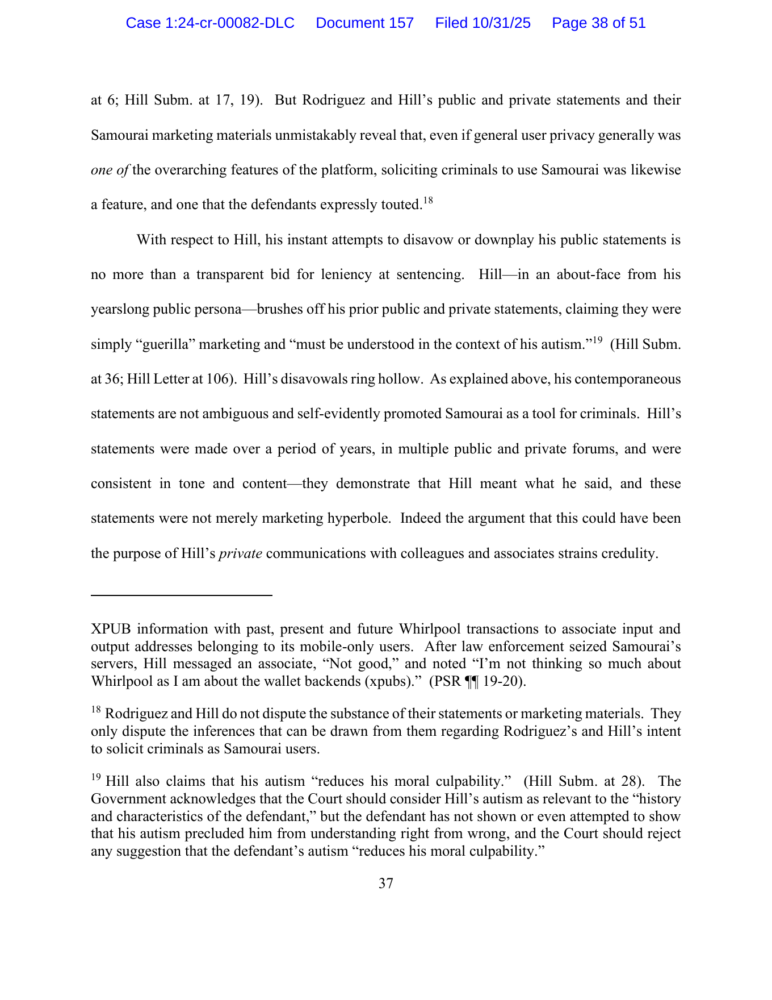

*The government’s sentencing memorandum records Hill’s post-seizure message: “Not good,” followed by his concern about “the wallet backends (xpubs).” [Open the archived filing](sources/legal/2025-10-31-government-sentencing-memorandum-ecf-157.pdf).*

The seizure did not create the xpub problem. It exposed the consequences of a design choice that had been there from the start.

This is a post-mortem, not a victory lap. A prison sentence cannot settle a protocol dispute, and an indictment cannot make every allegation true. I will distinguish what the public record establishes, what I infer from it, and what I remember but cannot independently prove.

To understand what was sitting on that server—and why I had spent years shouting about it—we have to go back to a README file in July 2017, before the feud began.

## How ZeroLink actually began

I wanted Samourai to succeed in implementing ZeroLink. I wanted more wallets to implement serious Bitcoin privacy, and I wanted ZeroLink to become useful software rather than another specification admired by a small circle and ignored by everyone else.

I created ZeroLink. The [repository](https://github.com/nopara73/ZeroLink/commits/master/) makes the chronology clear. I opened it on July 28, 2017. Before Samourai made a single commit, I had made 19 and written a 184-line, 2,883-word document containing the framework’s core architecture. Samourai’s first commit arrived two days later. Its title was [“Fix typos”](https://github.com/nopara73/ZeroLink/commit/8fbdcb9825a44aae8f963fcef328655a70b08b1e). It did exactly that.

ZeroLink was not merely a name for a CoinJoin transaction. It was a privacy framework for Bitcoin wallets: blinded coordination together with rules for network privacy, coin selection, transaction chains, and spending after the mix. I described that scope plainly in a 2021 Wasabi Research Club discussion: Chaumian CoinJoin was the protocol; ZeroLink was the broader wallet framework. That is the work Samourai later claimed to have co-created.[^zerolink]

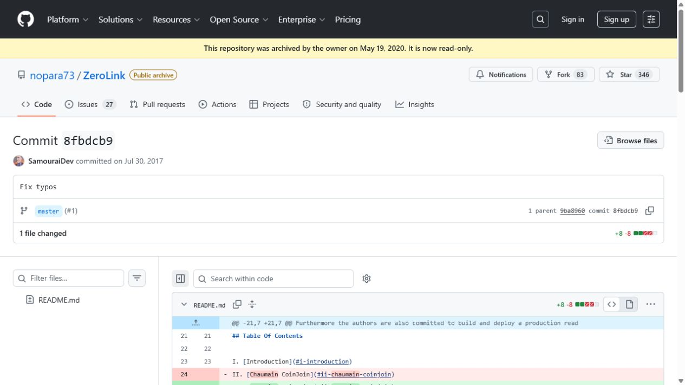

*SamouraiDev’s first ZeroLink commit, July 30, 2017: “Fix typos.” [Open the commit](https://github.com/nopara73/ZeroLink/commit/8fbdcb9825a44aae8f963fcef328655a70b08b1e).*

At the August 14 publication snapshot, Git blame attributes 6,126 of the document’s 6,627 words to me and 242 to Bill/TDevD. Their only sizeable technical addition concerned BIP47 and stealth addresses. I did not understand what problem it solved or why it belonged in ZeroLink. Instead of challenging it, I assumed that I was missing something and accepted it out of politeness. Two days later I clarified that BIP47 was not part of the protocol, and I removed the section in 2019. The rest of their work was overwhelmingly light editing. The complete commit and line-churn audit is preserved in the source note.[^zerolink]

I had also put TDevD in the Authors section before the BIP47 proposal was committed. Both decisions came from the same reflex: they spoke with confidence, I assumed that any confusion was mine, and I tried to be generous. This foreshadowed a later pattern. Their confidence made me doubt my own judgment, while my politeness was used to support a claim of authorship that the repository does not support.

By 2022—three years after I had publicly challenged the joint-creation claim, with the Git history still open for anyone to inspect—Samourai was still repeating it.[^7]

I regard those later repetitions as a lie. “Collaboration” can be innocent shorthand while nobody has disputed it. It stops being innocent after the primary record is placed in front of you and you keep telling the version that promotes you from reviewer and prospective implementer to co-creator. The false version gave Samourai ownership of the intellectual foundation it had adopted and made my later objections sound like jealousy over something we had supposedly invented together.

Our contact was limited. We barely spoke, and I was never part of Samourai. I had created ZeroLink; Samourai said it intended to implement it. Brian “Shinobi” Trollz, who observed the dispute at the time, later recalled a specific turning point. I asked for a week to consider whether coordinators could be run altruistically. During that week, he said, Samourai’s posture toward me [shifted into mockery](https://x.com/brian_trollz/status/1313283715188088838). By April 2019, I had recorded that they were no longer interested or responsive and that I had [continued independently](https://bitcointalk.org/index.php?topic=279249.700). People can disagree about why that limited contact ended. The authorship record is not a matter of recollection.

The authorship dispute mattered to me. The architectural difference mattered to users.

## The central privacy difference

Wasabi and Samourai did not merely choose two equally respectable collections of privacy tradeoffs.

Wasabi’s default architecture was built to deny its own operator the wallet graph. The backend distributed block filters; clients checked addresses locally; wallet traffic went through Tor; and blinded CoinJoin credentials prevented the coordinator from linking a registered input to its output. A user did not need to operate a personal server to hide addresses and transaction history from us. Privacy from the service operator was the default.[^operator]

Samourai’s default client did the opposite at the point that mattered most: it sent extended public keys to Samourai’s hosted backend. Whoever holds an xpub can derive its associated addresses and follow their transactions. Samourai’s own Dojo documentation disclosed the consequence indirectly. Running MyDojo improved privacy by “completely bypassing” the default hosted servers, while its Tracker recorded registered xpubs and addresses.[^operator]

Tor support existed, but it was not enabled by default. Samourai’s signed source allowed a user to create a wallet while Tor remained off, treated the Tor preference as `false` unless the user enabled it, and used the ordinary network path for xpub requests when Tor was disabled. A screenshot preserved in an April 2023 issue on Samourai’s own GitLab showed the wallet-creation screen with both Tor off and Dojo unconfigured. The user could continue by pressing “Create a new wallet.” That default exposed the user’s IP address to Samourai’s hosted service while the same service received the wallet’s xpubs.[^tor-default]

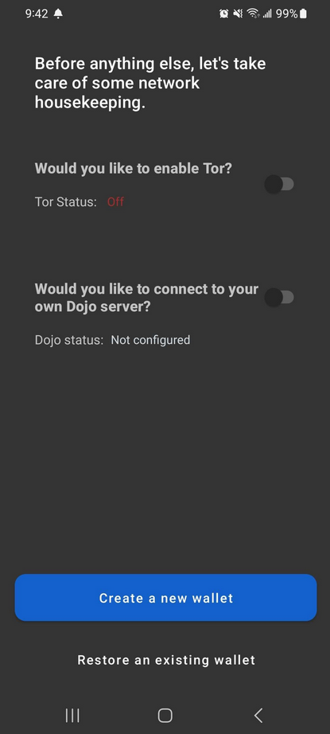

*The wallet-creation screen attached to Samourai’s own issue tracker: Tor off, Dojo not configured, and “Create a new wallet” still available. [Open the archived issue](https://web.archive.org/web/20230417145554id_/https://code.samourai.io/wallet/samourai-wallet-android/-/issues/458).*

The issue was titled “Important privacy features are disabled by default.” It proposed enabling Tor and Dojo by default or, at minimum, warning users what the off settings exposed. A Samourai project owner replied that the proposal would not be merged, called the report “concern trolling,” issued a “first and final warning,” and immediately closed the issue.[^tor-default] The privacy problem was reported on their own development platform. Their answer was to reject the change and threaten the person who reported it.

In July 2022, a user summarized the problem bluntly: “Xpub is sent to whirlpool servers.” Hill answered by changing the noun: “No xpubs are handled by the coordinator.” The xpubs went to Samourai’s wallet backend, not the Whirlpool coordinator. That distinction did not make the disclosure disappear. He then claimed that Samourai had implemented ZeroLink “on spec,” something I supposedly “didn’t have the skill set to do.” One post managed to evade the backend issue and reverse the authorship record at the same time.[^xpub-zerolink-post]

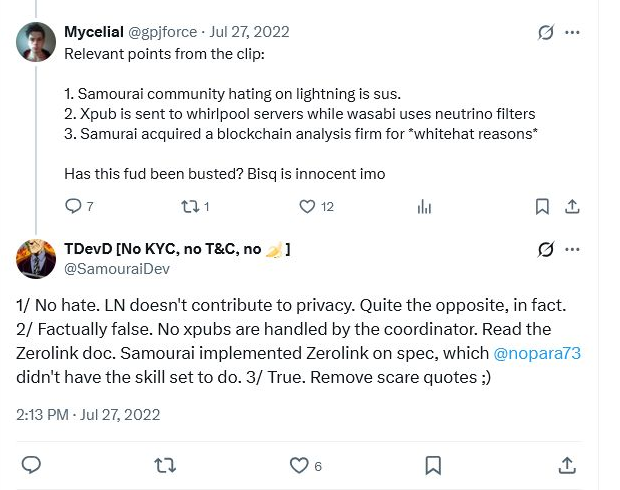

*The wallet-backend question was narrowed to the coordinator; the same reply claimed that Samourai implemented my specification because I lacked the skill. [Open the post](https://x.com/SamouraiDev/status/1552265920013271041).*

Sentinel, Samourai’s watch-only app, made the same architecture even easier to see. A watch-only wallet legitimately needs an xpub, and Sentinel correctly said that it could not spend the user’s coins. But the privacy question was what happened to the xpub after the user imported it. In August 2017, Samourai committed a change titled “move XPUB multiaddr to Samourai API.” From then on, Sentinel sent each tracked xpub to Samourai’s hosted backend. It did so for more than two years before Tor routing was added; when Tor arrived, its preference defaulted to off. The last pre-seizure source still let a user choose Samourai’s server, answer “No” to “Connect through Tor?”, and then posted imported xpubs to that server.[^sentinel] Sentinel did not give Samourai the power to steal the coins. It gave Samourai the power to map them. When used with the hosted server, collecting wallet maps was not incidental telemetry. It was how the product worked.

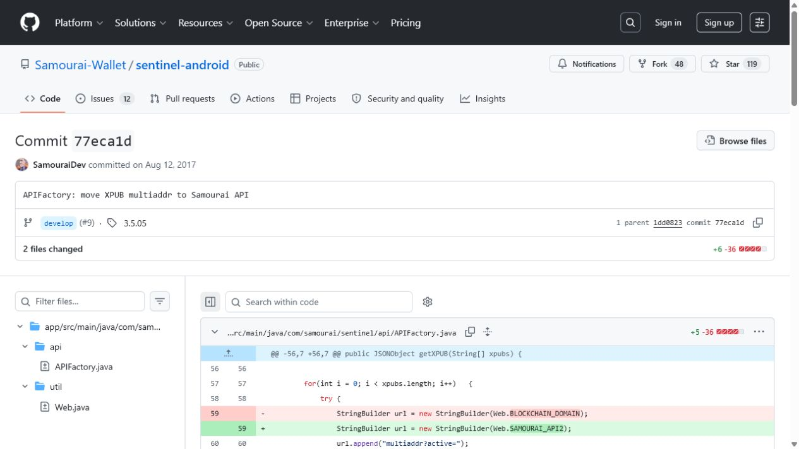

*The Sentinel commit that moved `XPUB multiaddr` queries to Samourai’s API. [Open the commit](https://github.com/Samourai-Wallet/sentinel-android/commit/77eca1d5bac90d4aba69067ab7db34127860a025).*

William was not merely an occasional contributor to the Blockchain.info Android wallet that preceded Samourai. He opened the surviving `Android-Wallet-2-App` history with its April 2014 initial commit and is its dominant visible developer by commit count. His own sentencing submission calls him Blockchain.com’s senior mobile developer; contemporary coverage identifies Keonne as the product lead responsible for the refreshed wallet’s interface and user experience. William’s commits even include “UI prep for shared coin,” Blockchain.info’s earlier mixing product. They did not create Blockchain.info itself, but they led the mobile-wallet project from which Samourai emerged.[^blockchain-lineage]

Samourai then kept its own source private for about a year. At the time, it said the delay was deliberate and intended to give the product a competitive “leg-up.” When the first public Samourai snapshot finally appeared in March 2016, it contained unmistakable Blockchain.info lineage: among other examples, its `BitcoinScript`, `BitcoinAddress`, `Hash`, and swipe-listener files descend closely from the earlier wallet. This does not mean every Samourai file was copied. It means the honest description is continuity, not a clean-sheet privacy wallet appearing from nowhere.[^blockchain-lineage]

SharedCoin matters because the old trust model was already understood. It was non-custodial, but its server constructed the joins and knew their links. In two Research Club discussions, participants treated that server knowledge as obvious: public transaction ambiguity could not provide privacy from the operator that already knew the mapping. When a 2021 paper named that weakness in SharedCoin but omitted Samourai’s default xpub collection, I objected. The products used different mechanisms, but the operator occupied the same privileged position. Samourai had rebuilt the problem it claimed to have left behind.[^wrc-xpub]

Dojo did not change what the default client disclosed. Most users of a mobile wallet will use the default, and even people who ran Dojo entered Whirlpool rounds alongside default-server users. If the common operator could identify or eliminate the outputs belonging to wallets it already knew, the effective anonymity set shrank for everyone; in some rounds, the remaining participants could be exposed by exclusion.[^1]

None of this is hindsight invented after the servers were seized. In an April 2020 Wasabi Research Club presentation about ZeroLink, I described the rejected design plainly: a trusted central server to which everyone sends their xpubs. That, I said, “obviously sounds pretty stupid,” which is why ZeroLink used blinded coordination instead. In July 2021, while reviewing a paper that contrasted Blockchain.info’s SharedCoin with Samourai, I objected that the comparison omitted the decisive fact: Samourai also learned wallet relationships because its default server collected xpubs. If the server has the xpub, repeated mixing cannot erase what the server already knows; and Dojo users still share rounds with users known to that server. In September 2022, discussing balance-query architectures, I warned that any other computer retaining an xpub could later be hacked or seized. The government seized Samourai’s servers in April 2024.[^wrc-xpub]

This was not a cosmetic difference between mobile convenience and desktop purity. It was the difference between a system designed so the operator could not know and a system that asked users to trust the operator not to use what it knew.

Wasabi was not perfect against every imaginable adversary. No honest system built on Bitcoin, Tor, fallible software, and human behavior can promise perfection. But against the service operator—the adversary at the center of this dispute—Wasabi placed cryptography and local processing between the user and us. Samourai relied on trust in its operator.

That was the first central hypocrisy. Samourai preached resistance to third-party surveillance while ordinary users entrusted it with a durable view of their wallets. When developers pointed out the contradiction, the honest response would have been simple: our default server receives your xpub; if that threat matters to you, run Dojo. Instead, Samourai attacked the people who explained the trust assumption.

## Sockpuppets and attacks on critics

My first *SamouraiLeaks* investigation began with a suspicion: one of Samourai’s developers appeared to be promoting the project and attacking its critics through an identity presented as independent.

In April 2019, I published [the evidence that “foneBTC” and “fone-btc” were TDevD/William Hill’s sockpuppet accounts](https://nopara73.medium.com/samouraileaks-samouraidevs-sockpuppet-exposed-7ce654b92c0b). The investigation is the proof. Its concluding exhibits are preserved below so the record does not depend on Medium remaining online.

<strong>View the sockpuppet investigation’s concluding exhibits</strong>

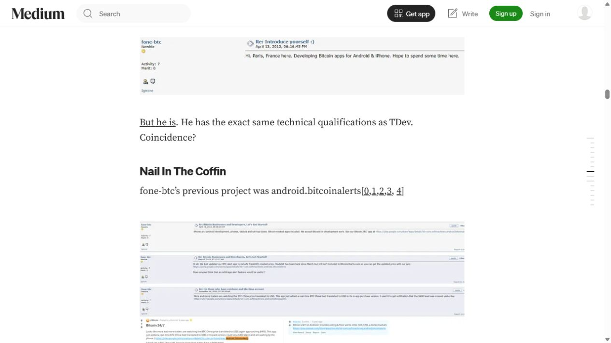

*The investigation connects `fone-btc`’s earlier Android project to Soft Machines SARL.*

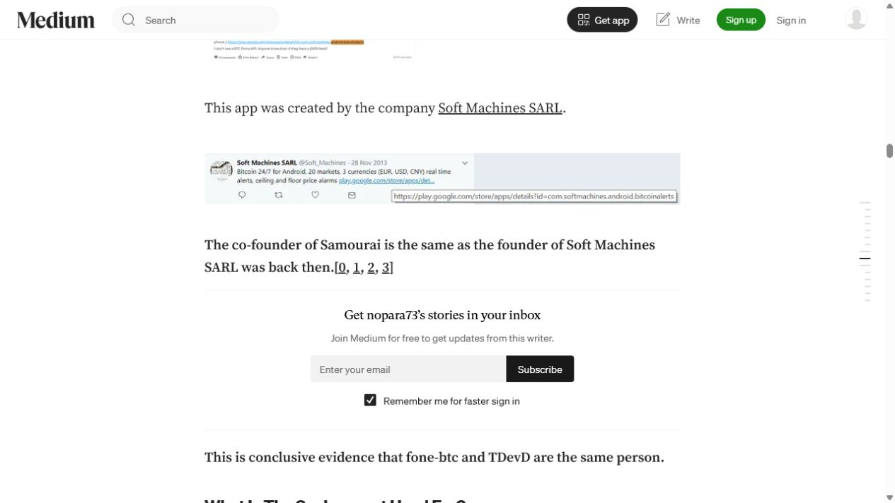

*The conclusion and the final Soft Machines exhibit. [Read the full investigation](https://nopara73.medium.com/samouraileaks-samouraidevs-sockpuppet-exposed-7ce654b92c0b).*

But the moral question does not turn on whether Bitcoin developers use pseudonyms. Pseudonyms are normal here. The problem is hidden affiliation used to manufacture consensus: one participant appearing to be several, promotion made to look organic, and an interested party presenting himself as a neutral observer. In a field where few users can audit every cryptographic claim themselves, reputation becomes part of the security model. Astroturfing corrupts that model.

I did not begin by publishing. I tried private conversation. I sought a mediator. I offered to stop discussing Samourai if the attacks stopped. I published when it became clear to me that silence would be treated not as de-escalation, but as permission.

Other developers then began describing the same experience.

Gregory Maxwell said architectural criticism was answered with harassment and accusations rather than a technical response. Nicolas Dorier reported the same reaction after pointing out that the default backend received users’ extended public keys. Their comments remain in the [original discussion](https://www.reddit.com/r/Bitcoin/comments/bhz37b/comment/elxasw8/), including [Dorier’s account](https://www.reddit.com/r/Bitcoin/comments/bhz37b/comment/elyijld/). Luke Dashjr said that disclosing an RPC-password exposure in a setup guide brought an accusation that he ran a criminal protection racket; his own qualification—that local networking or a VPN could limit the exposure—remains [in the thread](https://www.reddit.com/r/Bitcoin/comments/bjtks8/comment/emb6nr7/). I gathered those and similar accounts in [*SamouraiLeaks Part 2*](https://nopara73.medium.com/samouraileaks-part-2-harassment-of-bitcoin-developers-fae3019abd2f).

<strong>View Gregory Maxwell’s contemporaneous account</strong>

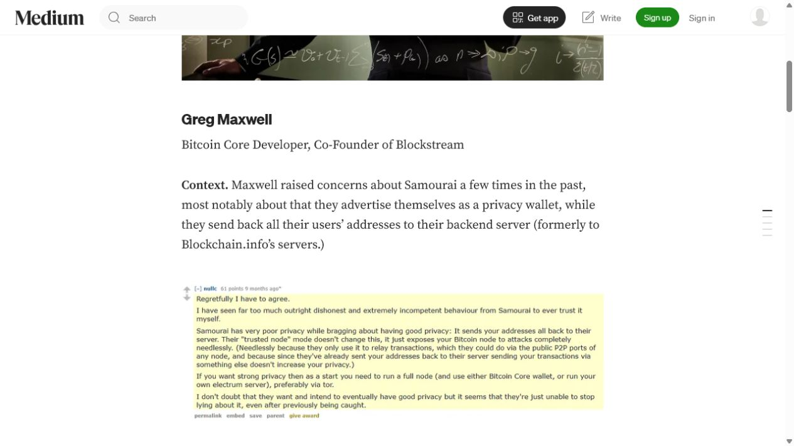

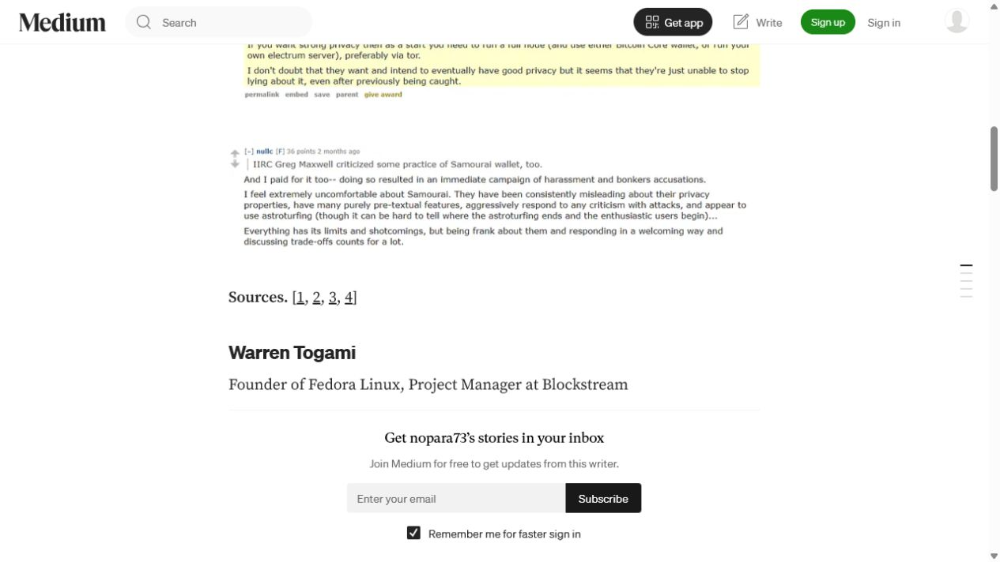

*Maxwell’s privacy warning and his account of the response, preserved in [SamouraiLeaks Part 2](https://nopara73.medium.com/samouraileaks-part-2-harassment-of-bitcoin-developers-fae3019abd2f).*

These people were not Wasabi employees forming a defensive wall around me. They disagreed with one another, and some criticized Wasabi too. What connected them was not allegiance to my software. It was the experience of raising a technical objection and watching the discussion pivot toward their motives, status, or character.

Chris Belcher later described substantive BIP47 objections being answered by [smears against the people raising them](https://x.com/chris_belcher_/status/1356299408464293888). ZmnSCPxj said Samourai had misrepresented his technical comments and again emphasized the privacy cost of the default server.[^2] A JoinMarket contributor acknowledged that individual criticisms on both sides could be valid while identifying Samourai’s counterattacks as the reason productive discussion became so difficult.[^3]

The effect was to change the subject from whether a technical claim was true to whether the person making it was credible or acceptable.

## Accuse loudly, qualify quietly

After enough repetitions, the sequence became predictable: start with something real—an uncertainty, a compromise, or a bug—then attach the most damaging interpretation available and promote it until it becomes the headline. When contrary evidence arrives, place the qualification where fewer people will see it: inside a reply, outside a screenshot, or silently inside a later code change.

The claim that I had admitted Wasabi supplied its own liquidity followed this pattern. I had made no such admission. The journalist responsible for the report [corrected the characterization](https://x.com/AsILayHodling/status/1267469894217596928), but the correction never travelled as far as the accusation. Another observer documented how Samourai’s presentation [excluded my correction and contrary replies](https://x.com/BTCparadigm/status/1267556260255334401).

A cropped account can be misleading even when every visible fragment is genuine, because the omitted context changes its meaning.

The same technique appeared elsewhere. In 2023, Samourai circulated criticism from Matt Corallo while [omitting his concluding post](https://x.com/ersolus/status/1631997876682346497). BlockDigest documented a smaller but revealing PayNym episode: a question about short-name mappings drew insults and brigading, and the issue was later patched without the public acknowledgment that would have turned a quarrel into routine engineering.[^4]

The Tor identity dispute provides another example. In April 2023, a user asked whether Whirlpool changed Tor circuits between input registration and output registration. Keonne Rodriguez answered categorically that it did and dismissed the questioner as a known liar.[^5] In March 2024, the Whirlpool client added an explicit [`changeIdentity()` call before output registration](https://github.com/Archive-Samourai-Wallet/whirlpool-client/commit/fbee9e820f511661c888a53c75a5e5e610b000f5). The code comment explained that the new identity was used to unlink the output from the input.

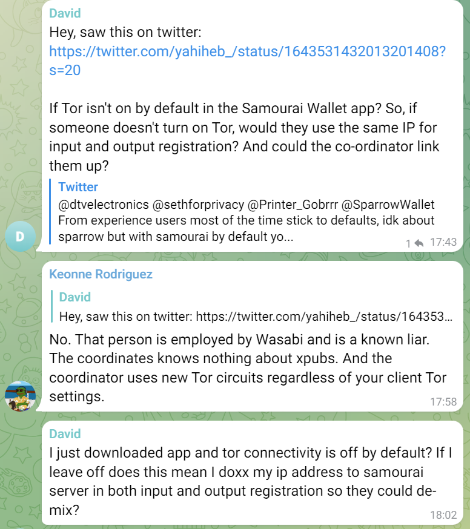

*April 2023: Rodriguez answered that the coordinator used new Tor circuits regardless of the client’s Tor settings and called the questioner a liar.*

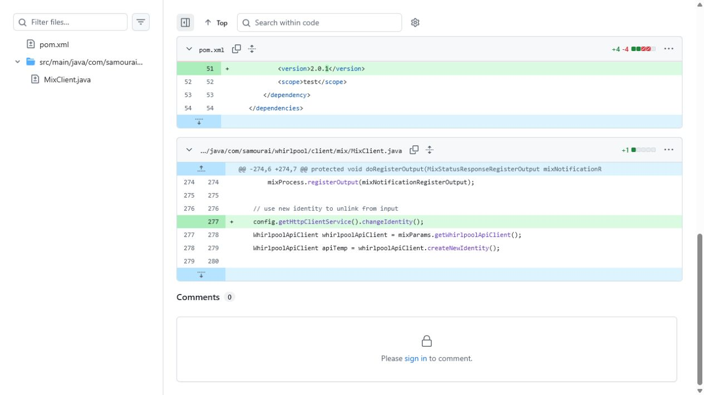

*March 2024: the client added `changeIdentity()` immediately before output registration, with the comment “use new identity to unlink from input.” [Open the commit](https://github.com/Archive-Samourai-Wallet/whirlpool-client/commit/fbee9e820f511661c888a53c75a5e5e610b000f5).*

<strong>View the commit header</strong>

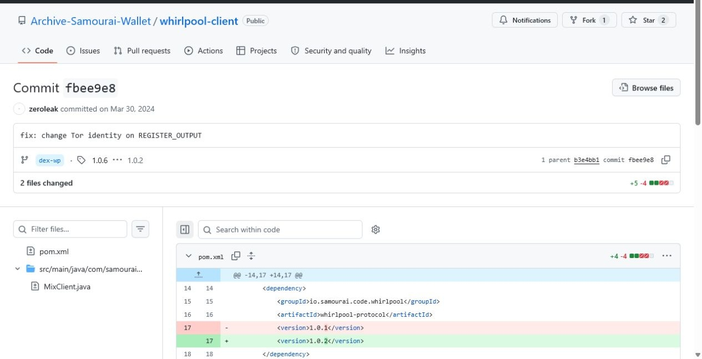

The commit does not prove that every earlier Whirlpool round was deanonymized, and it does not prove exploitation. It does show why categorical denials and personal abuse are poor substitutes for a precise answer. The defensible response in 2023 was to explain what the client did, what had been verified, and what remained uncertain. Instead, the answer was certainty plus an insult, followed later by a code change.

This habit did more than hurt people. It taught users to read every disclosure as an attack by one tribe on another. It taught developers to calculate the social cost of reporting a problem. Eventually even small bugs became hard to discuss, because asking the question meant volunteering to become the story.[^4]

Samourai did not need to break Wasabi to damage it. It needed accusations that looked like security research.

## The OXT “critical vulnerability” that failed its own test

OXT was not an independent research group that happened to agree with Samourai. In December 2017, Samourai announced that it had “finalized the acquisition” of OXT in an all-bitcoin transaction and called it a long-term strategic investment. OXT would remain a separate entity, the announcement said, but one “complementary” to Samourai. Years later, an OXT developer’s support letter included in William’s own sentencing submission described OXT as a Bitcoin forensic tool “owned and operated by Samourai Wallet.” The government separately noted that William and Keonne operated OXT as a tracing and wallet-attribution tool.[^oxt-owned]

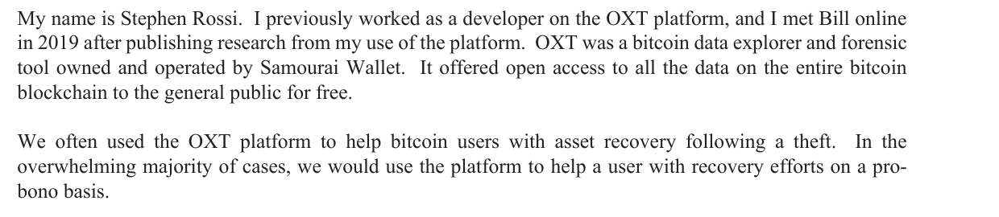

*An OXT developer’s letter in William’s sentencing submission describes OXT as a forensic tool “owned and operated by Samourai Wallet.” [Open the archived filing](sources/legal/2025-10-24-hill-sentencing-submission-ecf-155.pdf).*

We did not reject OXT’s work because it came from a rival. In March 2020, five months before OXT’s ultimatum, the Wasabi Research Club devoted an entire session to LaurentMT’s Boltzmann—the transaction-analysis tool Samourai’s own acquisition announcement had praised. We examined how it counted possible transaction partitions and where that number stopped being a measure of an individual user’s privacy. A high transaction-wide entropy score does not include everything a targeted observer may know from the network or the wider transaction graph, and computing all partitions becomes impractical for large Wasabi transactions. We engaged with the work in public before OXT attacked us. We rejected the later “critical vulnerability” because its premises failed.[^wrc-boltzmann]

In August 2020, this Samourai-owned research arm announced two supposed Wasabi vulnerabilities, rated them High/Critical, claimed they could cancel the privacy gained from earlier mixes, and gave us forty-eight hours to publish a warning on their terms. The full report contained a fatal premise: the attacker had to know the composition of the target’s wallet at a chosen point in time and know events affecting the wallet’s participation in later rounds. That was not a minor condition. It supplied the wallet membership that the alleged attack was supposed to uncover.[^6][^oxt-owned]

OXT avoided that problem in its demonstration by controlling both sides. Its target, “Alice,” received one known 0.4 BTC coin. Its observer, “Eve,” already knew which funds belonged to Alice and ran a modified Wasabi client that logged round events. Given the wallet’s exact starting state, the public coin-selection code could sometimes predict which of Alice’s coins the client would offer next. That showed that known software can behave predictably when the observer is handed its private starting state. It did not show how an outside observer could discover an unknown wallet’s contents, identify an unknown mixed output as the target’s, or recover an input-to-output link hidden by the protocol.[^6]

Even in that constructed test, the predictions did not simply work. The report recorded expected coins failing to enter rounds because of confirmation state, failed rounds, and coordinator behavior. OXT called these deviations “exogenous randomness.” Its second “vulnerability” was a proposed use of change-output “beacons and checkpoints” to notice when the first prediction had failed and investigate why. The report’s reduced “adjusted anonsets” were values produced by OXT’s own model. They were not identities uncovered, owners identified, or blinded input-output links recovered.[^6]

OXT’s follow-up did not repair the missing premise. It argued that a powerful adversary might possess exchange data, pooled surveillance information, or coordinator logs. An adversary might know many things. That does not demonstrate that this attack can acquire the wallet state it requires. My contemporaneous line-by-line response made the distinction: the report assumed near-complete knowledge of the target wallet; its conclusion that prior mixes were “cancelled” did not follow from that assumption; and OXT’s own spreadsheet had failed to predict the exact coins selected in its own wallet.[^6]

Adding randomness can be reasonable hardening without validating a claimed exploit. Samourai later treated Wasabi 2’s different selection behavior as an admission that OXT had been right.[^7] The timeline disproves that story. We established the Wasabi 2 research effort in January 2020 and publicly presented WabiSabi in June, before OXT’s August disclosure. Wasabi 2 was an already-planned replacement of the CoinJoin protocol and user experience, not a patch accepting OXT’s conclusions.[^6]

The contradiction is difficult to miss. OXT’s hypothetical Wasabi attacker needed to begin with a target’s wallet map. Samourai’s real default backend collected wallet maps. OXT’s own follow-up declared that privacy guarantees must come from “default software behavior,” not from placing the burden on the user. Samourai’s default failed that standard; its users had to run Dojo to escape the hosted server that OXT’s owner operated.[^oxt-owned]

## The trap of criminal association

The OXT report was part of a broader tactic. Samourai and OXT repeatedly attached Wasabi’s name to alleged criminal activity, then treated the association itself as evidence against us. The trap worked either way. If we answered, we helped spread the association. If we stayed silent, they presented the silence as a concession.

In several instances we never had a safe opportunity to answer. A meaningful response would have required disclosing operational knowledge, investigative methods, or decisions that could not be made public without compromising opsec. Samourai’s claims were therefore allowed to circulate largely unchallenged. Their survival online is not proof that they were true. Our silence was not agreement.

I cannot draw a straight causal line from one Samourai post to one institutional decision. I can say what followed: exchanges scrutinized Wasabi CoinJoin deposits, journalists carried the criminal-association narrative outward, and legal and regulatory pressure on the company increased. By 2022, the survival of the company-run coordination service was in question.

The default zkSNACKs coordinator then began rejecting some UTXOs. I had argued against blacklisting, and people who felt betrayed had a legitimate grievance. It was censorship by one service. It was not a mechanism for learning the relationship between accepted inputs and their outputs. The protocol still blinded that relationship; Wasabi remained MIT-licensed; and other coordinators could run without zkSNACKs’ policy.[^10]

Samourai converted that policy dispute into the claim that Wasabi had become a surveillance wallet. Meanwhile, Samourai’s own default backend received and retained the wallet maps of ordinary users. One system refused some inputs without learning their outputs. The other condemned surveillance while collecting the information needed to perform it.

## The megaphone was bigger than the product

Samourai’s Twitter presence made the rivalry look symmetrical. Its usage did not. Dumplings—my reproducible CoinJoin scanner—separated fresh bitcoin entering a mixer from coins merely being remixed and called fresh bitcoin the best on-chain proxy for adoption. From Whirlpool’s first detected month in April 2019 through the dataset’s end in August 2022, it identified 247,675 fresh BTC entering Wasabi and 30,228 entering Whirlpool. Wasabi led in every one of those forty-one months. This is a measure of bitcoin, not a user headcount, but it is the opposite of adoption parity.[^dumplings]

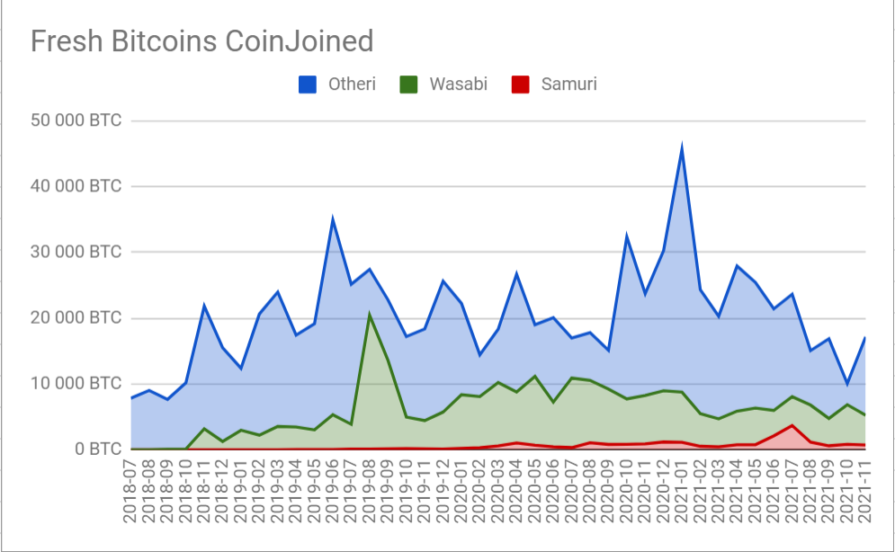

*Dumplings’ original “Fresh Bitcoins CoinJoined” chart. Wasabi is green; Whirlpool—labelled “Samuri” in the scanner—is red. The chart shown runs through November 2021; the archived data continues through August 2022. [Open the reproducible scanner](https://github.com/nopara73/Dumplings).*

Whirlpool’s headline transaction totals were enlarged by free remixes: the same bitcoin could appear in round after round without representing a new user or newly arriving funds. Twitter supplied the rest of the illusion. The conflict looked like a contest between equals because Samourai talked like one.

OXT’s report mattered because it gave a marketing attack the appearance of a vulnerability disclosure: a technical PDF, severe labels, a deadline, and claims that users were in immediate danger. Once the premise is examined, the result is much simpler. OXT demonstrated predictable code after giving its observer the information the protocol was designed to hide.

## Moving the problem did not solve it

Whirlpool’s strongest design slogan was that its CoinJoin transactions contained no toxic change. Literally, that was true. Practically, the toxic change still existed. Whirlpool moved it into the earlier `TX0` transaction and placed it in a separate account so users would be less likely to spend it with mixed coins. That separation was useful, but it was not elimination. Samourai itself later called these coins “unmixed toxic change” while proposing a way to swap them into Monero.[^whirlpool-design]

The same `TX0` publicly joined the deposit inputs, created the fixed-denomination premix outputs, and exposed which first Whirlpool rounds spent them. In a 2023 Research Club panel, a participant compared this directly with Wasabi 1 and made the narrow point that peeling change off before the CoinJoin did not create an additional break between that change and the first mix. It moved the point at which the change appeared.[^whirlpool-design]

Fixed denominations created another cost at both ends. A user could have to combine inputs publicly in `TX0` to enter a pool. Later, an ordinary payment would rarely equal one pool denomination, so the user could have to combine multiple post-mix outputs and create new change. The official Whirlpool server configuration enforced those denominations. This does not mean that equal-output CoinJoins provided no privacy. It means that a clean CoinJoin transaction was not the whole user journey, and remix counts could not prove that users preserved privacy when they eventually spent.[^whirlpool-design]

Ricochet had the same gap between a useful trick and a sweeping privacy impression. Its source built a default four-hop chain in which each transaction spent the previous one and reduced the forwarded amount by a calculated per-hop fee. That could frustrate a crude system that looked back only a fixed number of transactions. It also produced a recognizable shape. The Research Club flagged the unique fingerprint in 2020 but deferred a full analysis, so I do not present it as a proven deanonymization attack. I present it as another reason the marketing certainty was not earned.[^ricochet]

## Security claims require precision

The archive contains allegations of wildly different quality. Some are strong. Some are ambiguous. Some were mislabeled before I ever encountered them. A serious account must resist turning them into one undifferentiated charge sheet.

In 2021, an independent researcher disclosed a real local PIN-bypass weakness in Samourai Wallet. Restarting the app reset the attempt counter; wallet metadata required for an offline PIN search was available on the device; and the PIN space was small. The issue became [CVE-2021-36689](https://nvd.nist.gov/vuln/detail/CVE-2021-36689). According to the researcher’s timeline, Samourai acknowledged the report and initially decided not to fix it before public disclosure.[^13]

That is a legitimate security failure with a defined version and threat model. It is not evidence that a remote attacker could empty every Samourai wallet.

My *SamouraiLeaks Part 3* investigation concerned a different and earlier codebase: the Blockchain.info Android wallet project William led as senior mobile developer while Keonne served as product lead. The visible repository begins with William’s initial commit and attributes more commits to him than to any other developer. That history tied him to a generator that fetched entropy from Random.org over unencrypted HTTP. Under a narrow fallback path on older Android devices, a redirect combined with failed local entropy could produce deterministic key material.[^14][^blockchain-lineage] Ars Technica independently reported the conditions and risk in 2015.[^15]

That was a serious historical engineering failure. It was not proof that every Samourai wallet used broken randomness, and it was not proof that William stole anyone’s coins.

These qualifications do not weaken my case. They are my case.

Responsible disclosure means defining what happened, who was affected, what is inferred, and what remains unknown. Samourai’s communications culture treated those distinctions as weakness when answering critics, then demanded endless qualification when scrutiny turned inward.

The official account made the imbalance visible. It responded to technical and community critics with obscenities, slurs, and personal humiliation.[^16] Vlad Costea described losing followers and being called names after objecting to the bullying. A former r/Bitcoin moderator preserved his allegation that Samourai lied about how it received sidebar placement and free advertising.[^17]

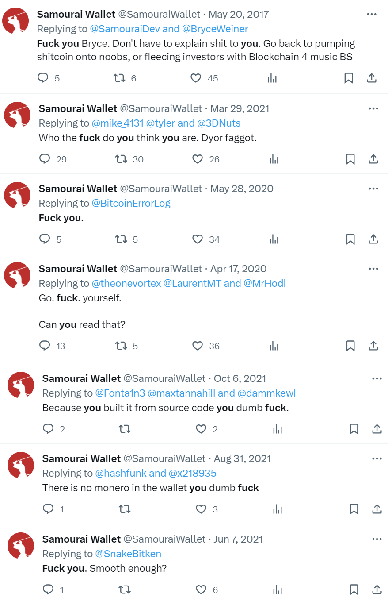

*A sample of replies from the official Samourai Wallet account. The language is reproduced because the conduct itself is part of the record.*

Any single quarrel can be rationalized. The repeated pattern is harder to dismiss. Intimidation was not a momentary failure of tone. It became part of the product’s public identity.

## When you wrestle with a pig, you both get dirty

The public record can show a cropped screenshot. It cannot fully show what years of this do to a person.

I began to approach technical conversations as possible trials of character. A bug report might become an allegation that I endangered users deliberately. A journalist’s imprecise sentence might become a confession attributed to me. An audio clip could be cut away from its context and circulated as my position. Silence allowed a false claim to spread. Answering kept the conflict going.

Time I wanted to spend on code went into preserving receipts. Friends and independent developers had to decide whether correcting the record was worth becoming the next target. The most painful part was not being insulted by strangers. It was watching a framework I created get folded into a joint-origin myth, then watching the project that benefited from my premature credit present me as an enemy of privacy.

I did not handle that well.

I called the project “Scamourai.” I swore at them. In 2019, CoinDesk quoted one of my replies simply saying “Fuck you.”[^18] The anger was real, but not everything it produced was useful. The nickname was memorable; it was also childish. It allowed a long evidentiary record to be mistaken for reciprocal mudslinging and made it easier for outsiders to conclude that both sides were merely marketing tribes.

I also sometimes spoke with more certainty than the evidence allowed. Receiving an xpub, retaining it, selling it, and maliciously querying it are separate claims. I knew the default backend received wallet-level public information. Before the server analysis became public, I did not know everything Samourai retained or did with it. I should have marked those boundaries in an angry tweet as carefully as I would in a protocol review.

That is my responsibility. It is not an equivalence.

My temper did not write the ZeroLink history. A rude reply did not crop the screenshots. Calling Samourai a name did not cause unrelated developers to report the same retaliation. I can regret the way I fought without pretending there was nothing specific I was fighting.

By April 2023, the conflict had passed far beyond professional hostility. I had received multiple death threats from William Hill—not one. I also received anonymous private threats during the same campaign. The screenshots alone cannot establish who controlled those anonymous accounts. After another dispute about Whirlpool’s Tor behavior, I wrote: [“In case something happens to me... I just received a death threat from William Hill”](https://x.com/nopara73/status/1647489516939382784). I did not publish every message, and what I did publish was only part of what I received.

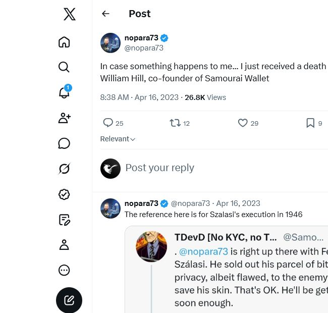

*My public statement on April 16, 2023, together with the reference I said I understood as threatening.*

One private message sent me a full address in Besenyszög. I blacked out the street-level portion before supplying the screenshot below. Another sender claimed to have checked an address and seen me and my “stinking tribe,” asked whether I thought I could stay safe, and ended: “We shall meet. Won’t be pretty on your end.” I cannot attribute an anonymous account from an interface label. I can show what arrived.

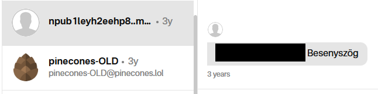

*A private message containing a full address in Besenyszög. I supplied this image with the identifying portion already blacked out; the archive contains no uncensored copy.*

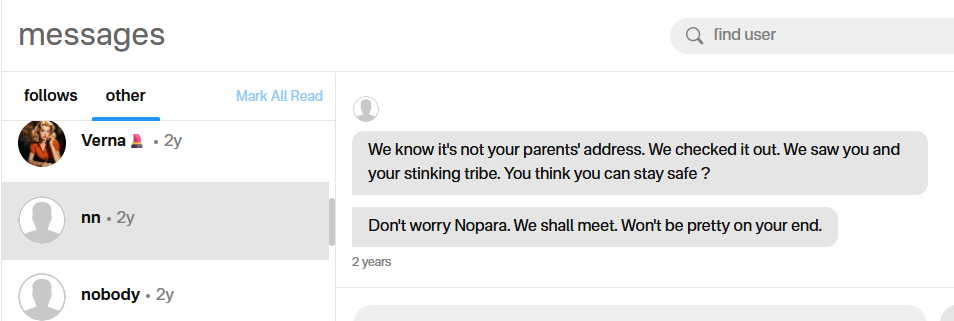

*A second anonymous account claimed to have checked an address and seen me, asked whether I thought I could stay safe, and threatened an eventual meeting. The screenshot records the message, not the sender’s identity.*

The threats were accompanied by doxxing. Hill posted my parents’ home address more than once. I will not reproduce or link to those posts, because proving that it happened does not require exposing them again. His public `@SamouraiDev` profile still names me, says, “It ain’t over until the fat boy is gutted,” and appends the name of the small town where my parents live.[^threats] There was no technical argument in publishing my family’s location beside violent language. It was intimidation.

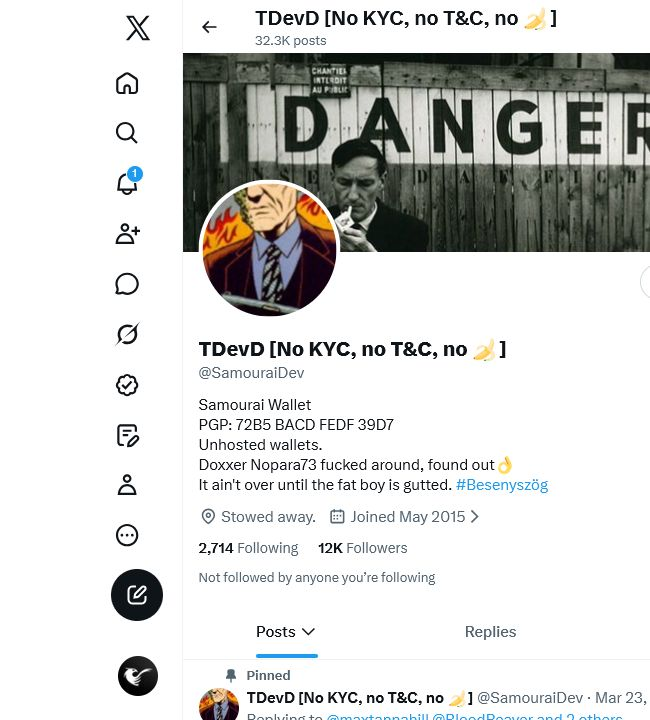

*The public `@SamouraiDev` profile as preserved on July 10, 2026. I have not reproduced my parents’ street address.*

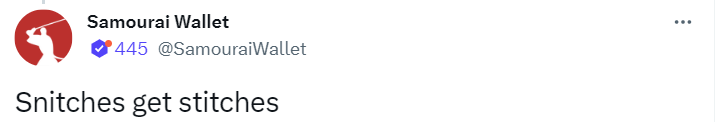

*The complete source image from the official Samourai Wallet account’s [“Snitches get stitches” post](https://x.com/SamouraiWallet/status/1648132389221068802), preserved again in [my contemporaneous record](https://x.com/nopara73/status/1648177095456223232) on April 18, 2023. X’s timeline preview cuts off part of the text; this archived source image does not.*

Two days later, Hill addressed me directly: “As a die hard collaborator, you deserve much worse.” He ended with, “Let’s see how this plays out, OK bud?” The attached image showed armed men surrounding a seated captive whose head was being shaved. In the context of calling me a collaborator and saying I deserved worse, it was not a technical argument.[^public-threats]

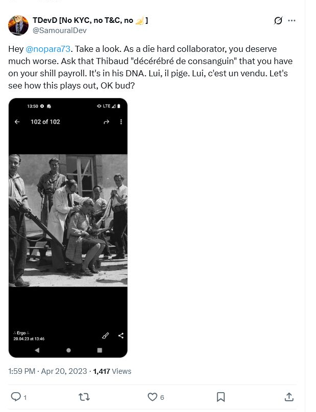

*Hill’s April 20, 2023 post paired “you deserve much worse” with an image of an armed public punishment. [Open the post](https://x.com/SamouraiDev/status/1649019968296566787).*

The campaign continued the next year. In February 2024, Hill wrote that I was “way overdue to get yours” and appended `#Besenyszög`. A follower replied, “Hope he gets stitches and ends up in a ditch.” Hill answered: “Yes.” Then: “Soon.”[^public-threats]

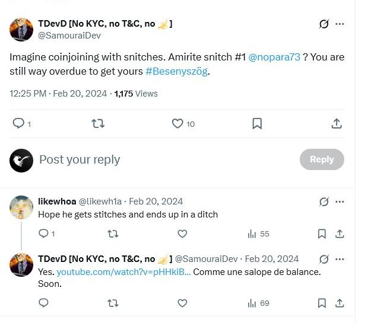

*The public February 20, 2024 thread: a location-linked warning, a reply hoping I would end up in a ditch, and Hill’s “Yes” and “Soon.” [Open the first post](https://x.com/SamouraiDev/status/1759902075217965125) and [Hill’s reply](https://x.com/SamouraiDev/status/1759958320289366412).*

Six weeks later, Hill made the violent reference unmistakable. “It ain’t over until the fat boy is gutted (see bio),” he wrote above Yasushi Nagao’s famous photograph of the assassination of Japanese Socialist Party chairman Inejirō Asanuma. I had remembered the victim as a Japanese prime minister. That detail was wrong. The recovered post corrects it. It does not soften what Hill chose to publish.[^public-threats]

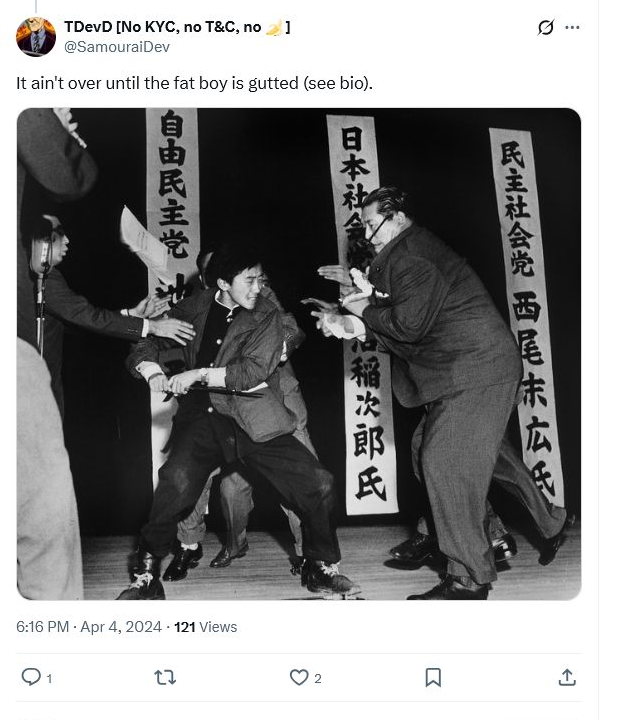

*Hill’s April 4, 2024 post paired “gutted” with the photograph of Asanuma’s onstage assassination. [Open the post](https://x.com/SamouraiDev/status/1775920406953701884).*

The criminal case later produced records independent of the feud.

## What the server seizure revealed

When Samourai’s founders were arrested in April 2024, I refused to treat the indictment as a verdict. Privacy software is not money laundering merely because criminals use it. The legal boundary around noncustodial software was—and remains—important.

But law enforcement also seized Samourai’s servers, and the later filings addressed technical issues I had been raising for years.

In an October 2025 sentencing memorandum, the government said its analysis showed that Rodriguez and Hill had retained enough information to trace or “demix” mobile users’ Whirlpool transactions. By cross-referencing stored xpubs with past, present, and future Whirlpool transactions, an analyst could connect the inputs and outputs of many transactions through complex analysis. The filing also stated an important limit: this did not by itself connect those transactions to real-world identities.[^xpub-seizure]

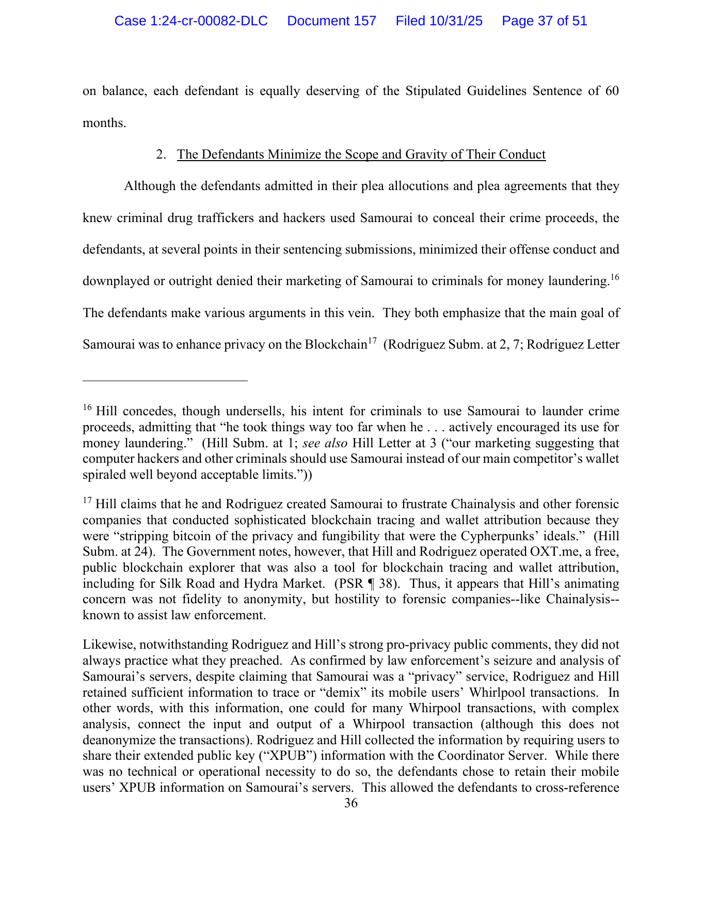

*The government’s description of the server analysis: retained mobile-user xpubs could be cross-referenced with Whirlpool transactions to connect inputs and outputs, without by itself identifying the real-world user. [Open the archived filing](sources/legal/2025-10-31-government-sentencing-memorandum-ecf-157.pdf).*

The defense did not deny xpub collection. Hill’s sentencing submission tried to recast it as a functional necessity: users without their own nodes needed the backend to calculate their balances, it said, and the design affected “only 20%” of Whirlpool users. That was a consequence of Samourai’s chosen architecture, not a universal requirement of light wallets. Wasabi obtained block filters and checked addresses on the client without giving our server the wallet’s xpub.[^operator] The filing also gave no source, methodology, underlying counts, or independent measurement for its percentage. It may have been nothing more than a figure supplied by Samourai and repeated by its lawyers. The submission gives us no way to know.[^xpub-seizure]

<strong>View the defense’s xpub argument and “only 20%” claim</strong>

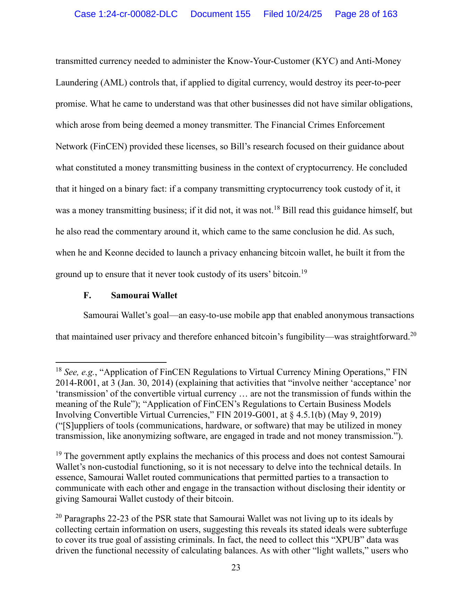

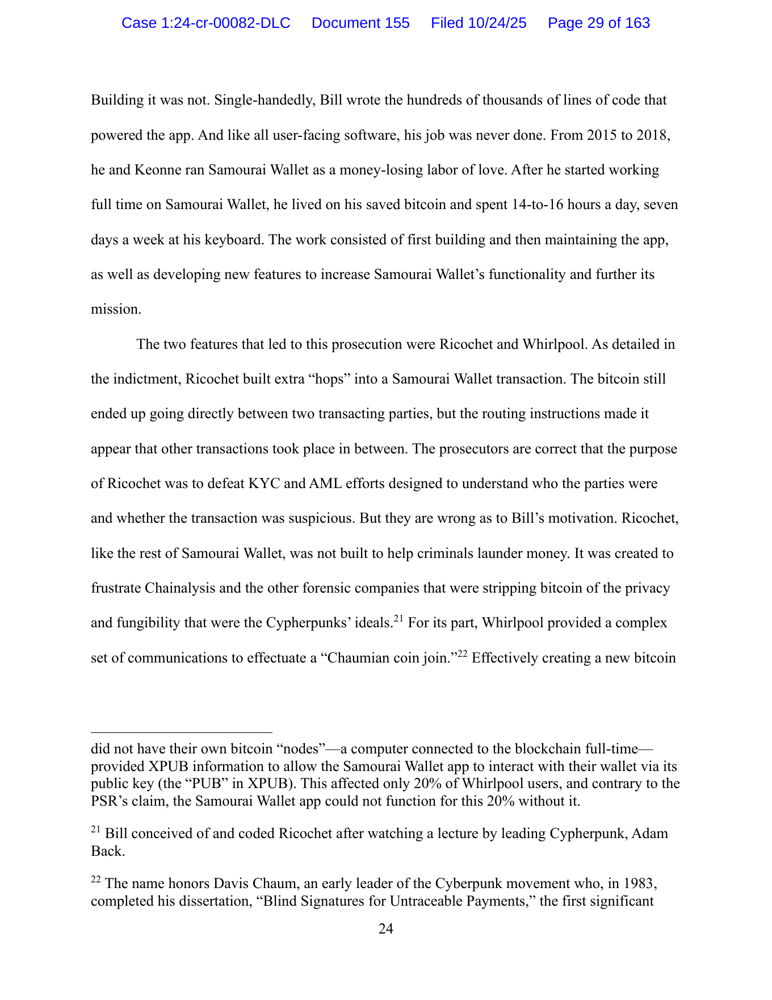

*Hill’s sentencing submission described xpub collection as functionally necessary and said it affected “only 20%” of Whirlpool users. The filing supplies no underlying measurement. [Open the archived filing](sources/legal/2025-10-24-hill-sentencing-submission-ecf-155.pdf).*

“Only” is doing a great deal of work there. So is the unsourced percentage.

Even if the defense’s estimate is accepted for the sake of argument, one in five Whirlpool users is a significant part of the user base. More importantly, the argument concedes the architecture I had objected to: a class of users provided its wallet graph to Samourai’s infrastructure; Samourai retained that information; and the seizure placed it in government hands. Dojo gave self-hosters a way out. It did nothing for users whose data was already on the default backend.

The June 2025 superseding indictment reproduced private messages and Dread posts in which Hill steered people who openly described criminal proceeds away from a competing mixer and toward Whirlpool. It said Rodriguez knew Hill was conducting substantial promotional work on Dread.[^19]

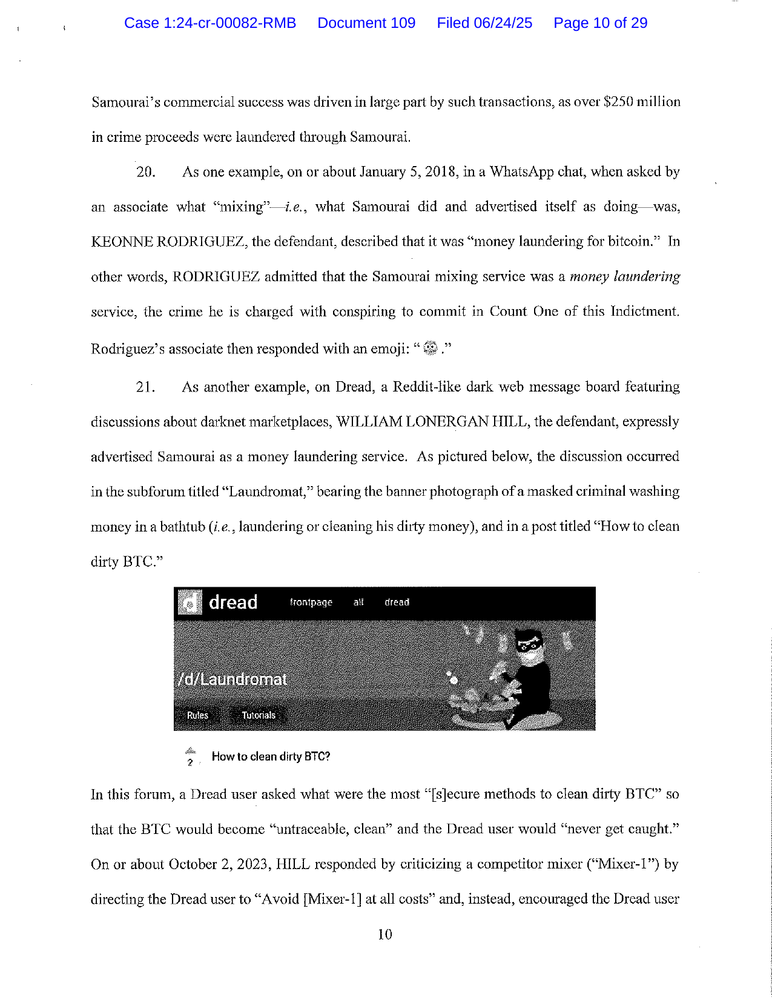

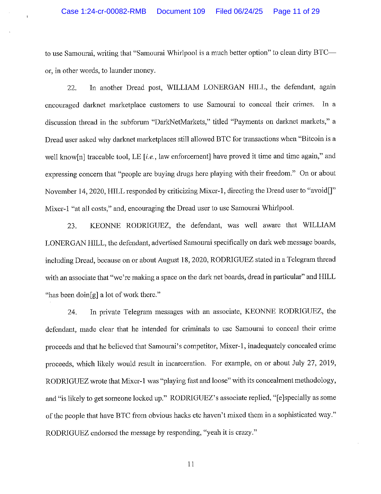

*Pages 10–11 of the superseding indictment reproduce the Dread context and allege that Hill steered users describing criminal proceeds toward Whirlpool, while Rodriguez knew he was doing promotional work there. An indictment is an allegation, not a verdict; both men later entered guilty pleas to the offense described below. [Open the archived indictment](sources/legal/2025-06-24-superseding-indictment-ecf-109.pdf).*

This mattered because Samourai and OXT had repeatedly turned criminal use of Wasabi into part of the public case against us. Yet the later record showed Samourai pursuing those same users as customers. On Dread, competitor disparagement was not an abstract contribution to privacy research. It was a sales pitch aimed at people asking how to conceal criminal proceeds.

In August 2025, Rodriguez and Hill each pleaded guilty to conspiring to operate a money-transmitting business knowing it transmitted crime proceeds. The money-laundering conspiracy count was dropped through the plea agreements. The Justice Department’s account of the pleas included their Dread marketing.[^21] In November, Rodriguez received five years in prison and Hill four.[^22]

I do not celebrate those sentences as the resolution of a software feud. Nor will I pretend the prosecution raised no troubling issues. Before the pleas, the defense argued that prosecutors had disclosed too late a FinCEN communication saying Samourai’s lack of control over users’ keys strongly suggested it was not a money-services business under FinCEN’s rules. The government disputed the communication’s significance.[^23] Anyone who cares about open-source privacy software should care about that due-process issue.

The state did not vindicate me. Prison cannot restore authorship, repair a community, or prove a protocol sound. What the case added was evidence about retention, intent, and marketing that had not been public when the feud began.

## The lies and hypocrisies

Not every mistake is a lie. Developers can be wrong. Memories can diverge. Certainty can come from arrogance rather than conscious deception. A lie requires something more: a materially false account preserved after contrary evidence has been presented because the false version remains useful.

By that standard, the ZeroLink co-creation story was a lie. The framework predated Samourai’s involvement; the first Samourai contribution fixed typos; and they repeated the joint-origin account years after I challenged it with the repository.[^zerolink][^7]

The claim that I had admitted Wasabi supplied its own liquidity was false. The journalist corrected that interpretation, but Samourai continued promoting the damaging version while omitting my correction.

The categorical Tor answer was a falsehood. The public evidence cannot tell us whether Rodriguez knowingly lied or answered with reckless certainty. It can tell us that he insulted the questioner and that the code later added the very identity change the question had asked about.[^5]

Samourai’s use of OXT was another direct hypocrisy. It denounced surveillance companies while owning and operating a blockchain tracing and wallet-attribution tool of its own. It then used that tool’s research label to issue a severe public warning against its principal competitor. OXT’s own declared rule was that privacy must be protected by the software’s defaults, not by work pushed onto the user. Samourai’s default collected the xpubs; avoiding that collection required the user to run Dojo.[^oxt-owned][^operator]

The deepest deception concerned the privacy promise itself. Samourai marketed resistance to financial surveillance while the default wallet sent xpubs to its hosted backend and left Tor off unless the user enabled it. The hosted service could therefore receive the wallet graph and the connecting IP address together. They also called Sentinel the “easiest and most secure” way to watch cold storage, while its hosted-server mode handed Samourai the xpub that allowed Samourai to watch it too. When the wallet’s unsafe defaults were reported on Samourai’s GitLab, the project owner rejected the proposed change, threatened the reporter, and closed the issue. The server seizure later demonstrated why the backend’s wallet-level information mattered.[^operator][^tor-default][^sentinel][^xpub-seizure]

The most direct hypocrisy concerned criminal association. Samourai repeatedly tried to turn alleged criminal use of Wasabi into a case against us while privately promoting Whirlpool to darknet users who openly described criminal proceeds.[^19][^21]

Even the blacklisting dispute contained this reversal. Criticism of zkSNACKs’ policy was fair. Calling Wasabi a surveillance wallet while Samourai retained xpub-derived wallet graphs was not. Wasabi’s policy determined which inputs one coordinator would accept, but its blinded design still prevented the operator from linking those inputs to their outputs. Samourai’s default backend retained wallet-level information.[^operator][^10][^xpub-seizure]

That is why I call it Scamourai.

I do not mean “fraud” as a legal count. I mean that the product’s central promise was false in ordinary language. It sold protection from surveillance while placing its operator in a position to surveil. It promoted verification while requiring default users to trust that Samourai would not misuse wallet information that its servers retained.

That was not merely imperfect privacy. The hypocrisy was built into the default architecture.

## Post-mortem

What did Samourai take from me?

Not my ability to write code. Not Wasabi’s existence. Not the Git record.

It took clarity of authorship. I gave TDevD more credit than the record justified, and Samourai inflated that gift into co-creation. Adoption became invention. Minor edits became joint research. Repetition turned a useful falsehood into public memory.

It also took years in which two projects could have competed while still teaching users the truth about their threat models. Samourai made correction look like surrender, uncertainty look like weakness, and disagreement look like disloyalty. It made cooperation difficult and turned technical competition into personal hostility.

I helped that transformation when I answered contempt with contempt. I cannot recover those years or unsay those words. What I can do is leave a record more careful than the fight itself.

The lesson I want future privacy developers to take is not “trust nopara73.” It is not “never trust a server,” “never trust a coordinator,” or “my CoinJoin was the good one.” It is this:

Do not treat a team identity or a founder’s character as a privacy guarantee. When a critic finds a bug, examine it before attacking the critic. When the evidence is uncertain, say so. When the code changes, correct the old claim as publicly as you made it. When a competitor is right, acknowledge it.

Most of all, judge a privacy system by what an adversary can obtain if the operator is compromised, coerced, or captured. The protocol should protect users even if the operator’s servers are seized.

---

## Sources and notes

[^zerolink]: The figures in this section were reproduced from the [ZeroLink repository](https://github.com/nopara73/ZeroLink) using the full commit graph, non-merge `README.md` numstats, and line-porcelain blame at commit [25d1502](https://github.com/nopara73/ZeroLink/commit/25d150216e3ab5027c5d2b79659d235252eb9daa), the August 14 publication snapshot used for the audit. The 13 Bill/TDevD commits comprise 97 additions and 43 deletions; nopara73’s 134 non-merge commits comprise 1,151 additions and 684 deletions. Line churn is not equivalent to intellectual authorship, which is why the chronology and individual patches are also described. In Research Club episode 26, [“A Survey on CoinJoin Transactions”](https://www.youtube.com/watch?v=l7bK85obzrM&t=3227s), at 53:47–54:52, I distinguish Chaumian CoinJoin from ZeroLink and describe ZeroLink as a broader privacy framework for Bitcoin wallets; see the [local transcript](sources/video/wasabi-research-club/transcripts/26-l7bK85obzrM.md). Episode 14, [“ZeroLink”](https://www.youtube.com/watch?v=8v_apbGPKrI&t=1659s), at 27:39–28:24, records my qualification that parts of the broader framework had aged while its Chaumian CoinJoin core remained sound; see the [local transcript](sources/video/wasabi-research-club/transcripts/14-8v_apbGPKrI.md).

[^operator]: Wasabi’s documentation explains its [block-filter and Tor architecture](https://docs.wasabiwallet.io/why-wasabi/NetworkLevelPrivacy.html), including why sending an xpub to a central server enables complete wallet deanonymization, and states that its [coordinator cannot link inputs to outputs](https://docs.wasabiwallet.io/FAQ/FAQ-Introduction.html). Samourai’s archived [Dojo documentation](https://archive.is/xUpKj) says MyDojo bypasses the default hosted servers and describes a Tracker that records the activity of registered xpubs and addresses. The inference about mixed Dojo/default-server rounds is also explained by Chris Belcher and the independent thesis cited in note 1.

[^blockchain-lineage]: The reproducible [source-lineage audit](sources/code/blockchain-samourai-lineage.md) preserves the exact commits, files, archives, and comparison scope. The surviving Blockchain.info [`Android-Wallet-2-App`](https://github.com/jisqyv/Android-Wallet-2-App) history begins with William Hill’s April 30, 2014 [`9f4e200` “Initial commit”](https://github.com/jisqyv/Android-Wallet-2-App/commit/9f4e200c7359f6aa687631c9674bc82050a13b0b); across its preserved refs, 352 commits are attributed to Hill identities, compared with 189 for the next-largest author. Hill also authored the September 2014 [`4063b3a` “UI prep for shared coin”](https://github.com/jisqyv/Android-Wallet-2-App/commit/4063b3a935afc377a8351656dfcf9f7cf95e52ce). A [contemporary interview](https://bitcoinist.com/the-future-of-blockchain-info/amp/), preserved [locally](sources/web/blockchain-info-future-bitcoinist.html), identifies Keonne Rodriguez as Blockchain.info’s product lead for the refreshed wallet’s UI and UX, while Hill’s [sentencing submission](sources/legal/2025-10-24-hill-sentencing-submission-ecf-155.pdf), submission pp. 21–22 (PDF pp. 26–27), identifies him as its senior mobile developer. Samourai’s public history begins with TDevD’s March 30, 2016 [`c6274d1`](https://github.com/Samourai-Wallet/samourai-wallet-android/commit/c6274d19b543a29edd46864d251bc56ee3510288); [contemporary coverage](https://www.ccn.com/samourai-bitcoin-wallet-goes-open-source/), preserved as a [local text snapshot](sources/web/samourai-open-source-ccn.md), quotes Samourai saying it had delayed publication for about a year to gain a competitive advantage. The audit documents several high-confidence file descendants without claiming that the whole application was a verbatim fork or that Hill and Rodriguez founded Blockchain.info.

[^wrc-xpub]: The complete locally archived [Wasabi Research Club transcript collection](sources/video/wasabi-research-club/README.md) includes the cited discussions. Episode 8, [“CashFusion with Jonald Fyookball & Ethan Heilman (Part 2)”](https://www.youtube.com/watch?v=bpLOSytc7vc&t=4425s), at 1:13:45–1:15:36, says the Blockchain.info server knew everything and that SharedCoin offered no privacy guarantee from the server; see the [local transcript](sources/video/wasabi-research-club/transcripts/08-bpLOSytc7vc.md). Episode 10, [“CoinJoin Sudoku”](https://www.youtube.com/watch?v=CtmSylCQNIc&t=1857s), at 30:57–31:59, likewise treats the server’s knowledge of the links as the starting assumption; see the [local transcript](sources/video/wasabi-research-club/transcripts/10-CtmSylCQNIc.md). Episode 14, [“ZeroLink”](https://www.youtube.com/watch?v=8v_apbGPKrI&t=257s), at 04:17–04:48, rejects the hypothetical trusted server collecting everyone’s extended public keys and explains blinded coordination; see the [local transcript](sources/video/wasabi-research-club/transcripts/14-8v_apbGPKrI.md). Episode 26, [“A Survey on CoinJoin Transactions”](https://www.youtube.com/watch?v=l7bK85obzrM&t=3347s), at 55:47–59:01, records the SharedCoin comparison, Samourai’s default xpub collection, the Dojo/default-user intersection, and the exclusion argument; see the [local transcript](sources/video/wasabi-research-club/transcripts/26-l7bK85obzrM.md). Research Club episode 30 (playlist position 32), [“Checking Bitcoin balances privately”](https://www.youtube.com/watch?v=8L725ufc-58&t=4315s), at 1:11:55–1:12:26, discusses the risk that an xpub retained on another computer could be exposed through hacking or seizure; see the [local transcript](sources/video/wasabi-research-club/transcripts/32-8L725ufc-58.md). The transcripts are YouTube auto-captions and are cited with timestamps; the essay paraphrases obvious recognition errors rather than silently quoting them as exact speech.

[^dumplings]: The [Dumplings repository](https://github.com/nopara73/Dumplings) describes `FreshBitcoins` as its “best proxy for user adoption”: bitcoin entering a recognized CoinJoin for the first time, excluding remixes. The exact source files used here are preserved at commit [`36f28f2`](https://github.com/nopara73/Dumplings/commit/36f28f27ab3753211acdbf9dde09ceb760ee834b) in the [local adoption-data archive](sources/code/dumplings-36f28f2-adoption-files.7z). The [reproduction note](sources/code/dumplings-adoption-audit.md) records the grouping method, monthly comparison, totals, scope, and limitations. From April 2019 through August 2022, the data sum to 247,675.31 fresh BTC for Wasabi and 30,228.14 for Whirlpool, a ratio of 8.19 to one; Wasabi’s monthly total is higher in all forty-one months. This metric measures fresh bitcoin volume, not unique installations or people.

[^oxt-owned]: Samourai’s December 21, 2017 [acquisition announcement](https://web.archive.org/web/20171224034645id_/http://blog.samouraiwallet.com:80/post/168785913782/samourai-oxt), preserved [locally](sources/web/samourai-oxt-acquisition-2017-wayback.html), says it had “finalized the acquisition” of OXT in an all-Bitcoin transaction, calls the purchase a long-term strategic investment, and describes OXT as a separate but complementary entity. OXT developer Stephen Rossi’s support letter in Hill’s [sentencing submission](sources/legal/2025-10-24-hill-sentencing-submission-ecf-155.pdf), PDF p. 130, calls OXT a forensic tool “owned and operated by Samourai Wallet”; the relevant passage is preserved as a [focused screenshot](sources/screenshots/hill-sentencing-oxt-owned-operated.png). The government’s [sentencing memorandum](sources/legal/2025-10-31-government-sentencing-memorandum-ecf-157.pdf), PDF p. 37 n.17, independently describes OXT as a tracing and wallet-attribution tool operated by Hill and Rodriguez. OXT’s [August 2020 follow-up](https://medium.com/oxt-research/an-update-on-the-disclosed-vulnerabilities-in-wasabi-wallet-4ac0e228acb9), archived [locally](sources/web/oxt-follow-up.md), calls OXT a “sparring partner for Samourai Wallet” and states: “The default software behavior should be responsible for maintaining the guarantees of a service, not the end user.”

[^wrc-boltzmann]: Samourai’s own [OXT acquisition announcement](https://web.archive.org/web/20171224034645id_/http://blog.samouraiwallet.com:80/post/168785913782/samourai-oxt) specifically praises LaurentMT’s Boltzmann as an open-source tool for measuring transaction plausible deniability. Wasabi Research Club episode 11, [“Boltzmann (Bitcoin)”](https://www.youtube.com/watch?v=CYIDAqMSc4A), was published March 17, 2020; the [local transcript](sources/video/wasabi-research-club/transcripts/11-CYIDAqMSc4A.md) records the full discussion. At 39:52–40:56, I question how transaction entropy applies to individual-user privacy, call anonymity set clearer for that purpose, and note that the partition calculation is infeasible for large Wasabi transactions. Episode 8, [at 44:12–45:46](https://www.youtube.com/watch?v=bpLOSytc7vc&t=2652s), makes the related distinction between the public fungibility of a transaction and the privacy of a particular user against an observer with additional network and graph information; see the [local transcript](sources/video/wasabi-research-club/transcripts/08-bpLOSytc7vc.md). These are limitations on what the metric establishes, not an allegation that Boltzmann itself was fraudulent.

[^whirlpool-design]: Samourai’s own July 2021 [statement about atomic swaps](https://medium.com/@SamouraiWallet/statement-regarding-atomic-swaps-and-twitter-mobs-7a3430f0253a), preserved as a [local text snapshot](sources/web/samourai-atomic-swaps-toxic-change.md), describes “unmixed ‘toxic change’ from Whirlpool CoinJoin transactions” and a proposed way to move it through Monero. The official [Whirlpool server configuration](https://github.com/Samourai-Wallet/whirlpool-server), preserved at exact commit `f23c2d3` in a [local source archive](sources/code/whirlpool-server-cited-files.zip), defines a fixed denomination for every pool, `TX0` fee rules, and equal input/output amounts for mixing. Research Club’s April 2023 panel [“Bitcoin Toxic Change in Coinjoin”](https://www.youtube.com/watch?v=Zu-bT9XojYk) is preserved in the [local transcript](sources/video/wasabi-research-club/transcripts/34-Zu-bT9XojYk.md). At 15:00–17:37, the panel’s Samourai-side explanation says `TX0` creates and isolates toxic change; at 50:33–52:42, another participant explains why moving that change before the CoinJoin does not add an on-chain break from the first mix; and at 1:04:39–1:07:44, the panel traces the public input consolidation in `TX0` and the post-mix consolidation and change required by arbitrary payments. The argument in the essay is limited accordingly: `TX0` improves accidental-spend protection and removes change from the CoinJoin transaction, but it does not make toxic change disappear from the user’s transaction history.

[^ricochet]: The pre-seizure Samourai Android source at commit [`c71f21a`](https://github.com/Samourai-Wallet/samourai-wallet-android/blob/c71f21a631bbc69db2bd411f2905c7f141d1523f/app/src/main/java/com/samourai/wallet/ricochet/RicochetMeta.java) provides the narrow implementation evidence. `RicochetMeta.java` sets a default of four hops; its loop makes each hop spend the preceding transaction and computes the forwarded amount from the final spend plus the remaining per-hop fees. The exact file is preserved in the [local cited-source archive](sources/code/samourai-wallet-android-c71f21a-cited-files.zip). Research Club episode 8, [at 1:25:04–1:26:07](https://www.youtube.com/watch?v=bpLOSytc7vc&t=5104s), contains the brief fingerprint objection and explicitly defers the debate; see the [local transcript](sources/video/wasabi-research-club/transcripts/08-bpLOSytc7vc.md). For that reason, the essay calls the pattern recognizable but does not claim a demonstrated deanonymization.

[^xpub-zerolink-post]: Hill’s [July 27, 2022 post](https://x.com/SamouraiDev/status/1552265920013271041) is preserved as [oEmbed metadata](sources/social/tweets/samouraidev-1552265920013271041.json) and a [context screenshot](sources/screenshots/x-samouraidev-2022-07-27-xpub-zerolink.png). The backend/coordinator distinction can be checked against the code and documentation collected in notes `operator`, `tor-default`, and `sentinel`; the authorship claim can be checked against the repository audit in note `zerolink`.

[^tor-default]: Samourai’s signed Android source at commit [`c71f21a`](https://github.com/Samourai-Wallet/samourai-wallet-android/tree/c71f21a631bbc69db2bd411f2905c7f141d1523f) (v0.99.95, June 17, 2020) provides direct evidence of the defaults. [`LandingActivity.java`](https://github.com/Samourai-Wallet/samourai-wallet-android/blob/c71f21a631bbc69db2bd411f2905c7f141d1523f/app/src/main/java/com/samourai/wallet/LandingActivity.java#L91-L125) permits wallet creation independently of the Tor switch and reads `ENABLE_TOR` with a `false` fallback. [`SamouraiApplication.java`](https://github.com/Samourai-Wallet/samourai-wallet-android/blob/c71f21a631bbc69db2bd411f2905c7f141d1523f/app/src/main/java/com/samourai/wallet/SamouraiApplication.java#L28-L33) starts Tor only when that preference is true. [`APIFactory.java`](https://github.com/Samourai-Wallet/samourai-wallet-android/blob/c71f21a631bbc69db2bd411f2905c7f141d1523f/app/src/main/java/com/samourai/wallet/api/APIFactory.java#L373-L405) sends xpub queries through the ordinary `postURL` path when Tor is not required, and its [xpub-registration method](https://github.com/Samourai-Wallet/samourai-wallet-android/blob/c71f21a631bbc69db2bd411f2905c7f141d1523f/app/src/main/java/com/samourai/wallet/api/APIFactory.java#L430-L489) makes the same direct/Tor distinction. The archived April 17, 2023 [GitLab issue #458](https://web.archive.org/web/20230417145554id_/https://code.samourai.io/wallet/samourai-wallet-android/-/issues/458) preserves the screenshot of Tor off and Dojo unconfigured, the proposed safer defaults, the project owner’s response, and the immediate closure. Samourai’s own 2021 account described Tor as something users could activate [with a button](https://medium.com/samourai-wallet/supporting-the-tor-network-with-a-50-000-donation-to-the-tor-project-98cb8896e652); contemporary setup guides likewise instructed users to enable it.

[^sentinel]: Sentinel’s own [welcome text](https://github.com/Samourai-Wallet/sentinel-android/blob/cf4617753168198b9816506b1a25f7bdd65ec207/app/src/main/res/values/strings.xml#L4) called it the “easiest and most secure” way to watch cold storage and emphasized that private keys were never communicated to the app; that statement addressed custody, not xpub privacy. The official repository shows the relevant history directly. On August 12, 2017, commit [`77eca1d`](https://github.com/Samourai-Wallet/sentinel-android/commit/77eca1d5bac90d4aba69067ab7db34127860a025) changed the xpub `multiaddr` request from Blockchain.info to Samourai’s API. Commit [`1a4722f`](https://github.com/Samourai-Wallet/sentinel-android/commit/1a4722f8e35da8355bb763dc3005602da29109cf), dated September 20, 2019, added Tor routing and a network dashboard. In the ensuing v3.6 source, [`APIFactory.java`](https://github.com/Samourai-Wallet/sentinel-android/blob/cf4617753168198b9816506b1a25f7bdd65ec207/app/src/main/java/com/samourai/sentinel/api/APIFactory.java#L73-L87) sends each xpub as `multiaddr?active=<xpub>`; [`InsertSegwitActivity.java`](https://github.com/Samourai-Wallet/sentinel-android/blob/cf4617753168198b9816506b1a25f7bdd65ec207/app/src/main/java/com/samourai/sentinel/InsertSegwitActivity.java#L70-L89) separately posts the imported xpub to the `/xpub/` endpoint; and [`WebUtil.java`](https://github.com/Samourai-Wallet/sentinel-android/blob/cf4617753168198b9816506b1a25f7bdd65ec207/app/src/main/java/com/samourai/sentinel/util/WebUtil.java#L49-L65) reads the Tor preference with a `false` fallback, while its [API selector](https://github.com/Samourai-Wallet/sentinel-android/blob/cf4617753168198b9816506b1a25f7bdd65ec207/app/src/main/java/com/samourai/sentinel/util/WebUtil.java#L283-L289) uses the public Samourai endpoint when Tor is not required. A mirror preserving the last pre-seizure GitLab history shows the same design in v5: the first-run screen offered [Samourai’s server and a separate yes/no Tor prompt](https://github.com/noosphere888/sentinel-android/blob/b5ef29c14adbd65bb596f60856c8e5129cdcf000/app/src/main/java/com/samourai/sentinel/ui/home/HomeActivity.kt#L286-L320), while [`ApiService.kt`](https://github.com/noosphere888/sentinel-android/blob/b5ef29c14adbd65bb596f60856c8e5129cdcf000/app/src/main/java/com/samourai/sentinel/api/ApiService.kt#L114-L141) posted the imported xpub to `/xpub`. RoninDojo’s contemporary [v5 guide](https://blog.ronindojo.io/discover-version-5-0-0-of-sentinel/) independently describes the choice between the user’s Dojo and Samourai’s node.

[^threats]: My [April 16, 2023 public statement](https://x.com/nopara73/status/1647489516939382784) records one of the threats. Hill’s public [`@SamouraiDev` profile](https://x.com/SamouraiDev), checked July 10, 2026, names me, uses the quoted “gutted” language, and appends my parents’ town. Current social-media index caches independently reproduce the same profile text, including [this TwStalker index](https://twstalker.com/rottenwheel1) and [this second index](https://www6.twstalker.com/starlabsltd). My parents’ street address is intentionally neither reproduced nor linked.

[^public-threats]: The public sequence is preserved through the original posts and local records: Hill’s April 15, 2023 [Szálasi comparison and “getting his soon enough”](https://x.com/SamouraiDev/status/1647203226352074752); the official wallet account’s April 18 [“Snitches get stitches” post](https://x.com/SamouraiWallet/status/1648132389221068802); Hill’s April 20 [“you deserve much worse” image post](https://x.com/SamouraiDev/status/1649019968296566787); his February 20, 2024 [“overdue to get yours #Besenyszög” post](https://x.com/SamouraiDev/status/1759902075217965125) and [“Yes ... Soon” reply](https://x.com/SamouraiDev/status/1759958320289366412); and his April 4 [“gutted” assassination-image post](https://x.com/SamouraiDev/status/1775920406953701884). The corresponding oEmbed JSON, screenshots, and two original media files are archived under `sources/social/` and `sources/screenshots/`. [World Press Photo](https://www.worldpressphoto.org/collection/photo-contest/1961/yasushi-nagao/1) identifies Nagao’s image as Otoya Yamaguchi assassinating Socialist Party chairman Inejirō Asanuma during a speech at Hibiya Hall.

[^1]: Denis Varga, [*CoinJoin Protocols and Implementations Analysis*](https://is.muni.cz/th/kbvx1/Master_Thesis.pdf), Masaryk University master’s thesis, 2022, especially pp. 58–70. The thesis found that Whirlpool closely followed its detailed specification, described Wasabi 1’s specification as outdated relative to its implementation, and emphasized the privacy trust placed in Samourai’s default backend. See also Greg Maxwell’s [2018 architectural criticism](https://www.reddit.com/r/Bitcoin/comments/9r9344/comment/e8fm1v8/) and Chris Belcher’s explanation of the [mixed Dojo/default-server anonymity set](https://x.com/chris_belcher_/status/1286640749082271744).

[^2]: ZmnSCPxj, [Reddit comment](https://www.reddit.com/r/Bitcoin/comments/ku97pu/comment/gir5dzm), January 2021. He said Samourai had misconstrued his “pure ZeroLink” comment and distinguished using the default backend from running one’s own node and software.

[^3]: *Citadel Dispatch*, [“JoinMarket Dev: Wasabi vs Samourai”](https://www.youtube.com/watch?v=hdLk4lSoLz8), December 2022, especially 11:24–19:43. The relevant clip was also [posted to Reddit](https://www.reddit.com/r/Bitcoin/comments/zpnug5/joinmarket_dev_wasabi_vs_samourai/).

[^4]: BlockDigest, [SHI256 episode 256](https://www.youtube.com/watch?v=_Z5SwEnTOsU&t=3462s), especially 57:42–64:10, discussing PayNym short-name caching, the response to questions, and the later patch.

[^5]: [Screenshots of the April 2023 Telegram exchange](https://imgur.com/a/XgushDQ). The gallery preserves Rodriguez’s categorical answer and the surrounding dispute. The later code commit is linked in the body.

[^6]: OXT’s archived [full technical report](https://web.archive.org/web/20201024205505id_/https://research.oxt.me/static/public/resources/wasabi-disclosure/wasabi-report-full.pdf) supplies the details omitted from its public warning. On pp. 2–3 it requires knowledge of the target wallet’s composition at step N and knowledge of subsequent mixing events. On pp. 5–7 its test gives “Eve” knowledge of “Alice’s” funds and wallet state, starts Alice with a single known 0.4 BTC input, and uses a modified client to log round events. The report’s “vulnerability #2,” on pp. 4–5, uses change-output “beacons and checkpoints” to detect deviations from the first model. The resulting “adjusted anonsets” are OXT’s analytical estimates; the test does not identify Alice as a real person or recover a blinded input-output mapping. OXT’s [initial warning](https://coinexplorers.com/insights/warning-about-two-discovered-vulnerabilities-in-wasabi-wallet-idqdri) demanded a public statement within forty-eight hours and labeled the claims Critical. My [contemporaneous line-by-line response](https://www.reddit.com/r/WasabiWallet/comments/icvu58/any_statement_to_this_is_this_true/) identifies the assumed wallet knowledge, the unsupported leap to “cancelling” previous mixes, and OXT’s failed predictions in its own spreadsheet. OXT’s [follow-up](https://medium.com/oxt-research/an-update-on-the-disclosed-vulnerabilities-in-wasabi-wallet-4ac0e228acb9) answers the missing-knowledge objection by hypothesizing powerful adversaries with pooled data and coordinator logs, but does not demonstrate how its tested observer acquired the target wallet state. The claim that Wasabi 2 was a response is also contradicted by the public timeline: Bitcoin Optech covered WabiSabi on [June 17, 2020](https://bitcoinops.org/en/newsletters/2020/06/17/), and the Wasabi 2 [status report](https://coinexplorers.com/insights/wasabi-wallet-2-0-status-update-kdocsu) says the research team was established in January 2020—both before OXT’s August disclosure.

[^7]: Bitcoin Takeover, [interview with Samourai Wallet](https://www.youtube.com/watch?v=_UZKNK3DZJo), June 2022, especially 15:20–18:58. The interview repeats Samourai’s joint-origin account of ZeroLink and presents Wasabi 2’s later selection behavior as confirmation that OXT’s criticism forced a fix. The ZeroLink repository does not support co-creation, while the WabiSabi timeline in note 6 predates OXT’s disclosure.

[^10]: The original March 2022 announcement is quoted in [contemporaneous coverage](https://bitcoinist.com/wasabi-coinjoin-blacklisted-utxos-samourai/). zkSNACKs later explained in this [open discussion](https://bitcointalk.org/index.php?topic=5405325.0) that the company was under legal and regulatory pressure, did not want to perform its own surveillance, and expected alternative coordinators to remain possible. The operational pressure described in the body is my first-person recollection; the linked public sources corroborate the general context, not every internal detail.

[^13]: Justin Steven, [“Samourai Wallet Bitcoin PIN Authentication Bypass”](https://vrls.ws/posts/2021/08/samourai-wallet-bitcoin-pin-authentication-bypass-crypto/), August 2021. The post contains the technical report, proof of concept, affected version, and disclosure timeline.

[^14]: My article, [“SamouraiLeaks Part 3: Is random.org Random Enough?”](https://nopara73.medium.com/samouraileaks-part-3-is-random-org-random-enough-35704796ae93), July 2019; the historical [`RandomOrgGenerator.java`](https://github.com/jisqyv/Android-Wallet-2-App/blob/dfb781c05536db58eb253ab5c37b82c237213382/src/piuk/blockchain/android/util/RandomOrgGenerator.java). Repository history attributes the relevant 2014 commit to William Hill.

[^15]: Dan Goodin, [“Crypto Flaws in Blockchain Android App Sent Bitcoins to the Wrong Address”](https://arstechnica.com/information-technology/2015/05/crypto-flaws-in-blockchain-android-app-sent-bitcoins-to-the-wrong-address/), *Ars Technica*, May 2015; original [technical discussion](https://www.reddit.com/r/Bitcoin/comments/37oxow/the_security_issue_of_blockchaininfos_android/).

[^16]: [Gallery of posts from the official Samourai account](https://imgur.com/a/uSDlT6C); one surviving [March 2021 post](https://x.com/SamouraiWallet/status/1376313082658496516). The purpose of citing these is to document tone and targeting, not to endorse repeating the slurs.

[^17]: Vlad Costea, [post about the reaction to criticizing Samourai](https://x.com/Vladcostea/status/1298771143655124993), August 2020; BashCo, [archived post about the r/Bitcoin promotion dispute](https://web.archive.org/web/20200826200048id_/https://twitter.com/BashCo_/status/1298711774951137282), August 2020.

[^18]: Leigh Cuen, [“A Battle Between Bitcoin Wallets Has Big Implications for Privacy”](https://www.coindesk.com/markets/2019/08/06/a-battle-between-bitcoin-wallets-has-big-implications-for-privacy), *CoinDesk*, August 2019. The article is a useful contemporary record of the dispute, but its competitive framing should be read against the default xpub asymmetry documented above.

[^xpub-seizure]: The U.S. Attorney’s Office said that Icelandic authorities [seized Samourai’s web servers and domain](https://www.justice.gov/usao-sdny/pr/founders-and-ceo-cryptocurrency-mixing-service-arrested-and-charged-money-laundering) on April 24, 2024. The government’s later [sentencing memorandum](https://storage.courtlistener.com/recap/gov.uscourts.nysd.615996/gov.uscourts.nysd.615996.157.0.pdf), *United States v. Rodriguez and Hill*, No. 1:24-cr-00082-DLC, ECF No. 157 (S.D.N.Y. Oct. 31, 2025), pp. 36–37, says server analysis showed retained xpub data could be used, through complex analysis, to associate inputs and outputs for many mobile users’ Whirlpool transactions; it also reproduces Hill’s post-seizure messages about the “wallet backends (xpubs).” Hill’s own [sentencing submission](https://storage.courtlistener.com/recap/gov.uscourts.nysd.615996/gov.uscourts.nysd.615996.155.0.pdf), ECF No. 155 (S.D.N.Y. Oct. 24, 2025), pp. 23–24 & n.20, argues that xpub collection was necessary for light-wallet balance calculation and asserts that it affected 20 percent of Whirlpool users. The submission provides no citation, methodology, underlying counts, or independent study for that percentage, and the government’s memorandum does not validate it. The government’s “demix” finding is itself a representation in a sentencing memorandum, not an independently published forensic report.

[^19]: *United States v. Rodriguez and Hill*, [Superseding Indictment](https://storage.courtlistener.com/recap/gov.uscourts.nysd.620167/gov.uscourts.nysd.620167.109.0.pdf), No. 1:24-cr-00082-RMB, ECF No. 109 (S.D.N.Y. June 24, 2025), especially pp. 10–16. These passages were allegations at the time of filing; later admissions are separately cited below.

[^21]: U.S. Attorney’s Office, Southern District of New York, [“Founders of Samourai Wallet Cryptocurrency Mixing Service Plead Guilty”](https://www.justice.gov/usao-sdny/pr/founders-samourai-wallet-cryptocurrency-mixing-service-plead-guilty), August 6, 2025. For the plea bargain’s dismissal of the laundering count, see [contemporaneous reporting](https://bitcoinmagazine.com/news/samourai-wallet-developers-plead-guilty).

[^22]: U.S. Attorney’s Office, Southern District of New York, [“Founders of Samourai Wallet Cryptocurrency Mixing Service Sentenced to Five and Four Years in Prison”](https://www.justice.gov/usao-sdny/pr/founders-samourai-wallet-cryptocurrency-mixing-service-sentenced-five-and-four-years), November 19, 2025.

[^23]: Defense letter alleging late disclosure of FinCEN communications, [*United States v. Rodriguez and Hill*](https://bitcoinmagazine.com/wp-content/uploads/2025/05/https_dechert_my_sharepoint_com_personal_cflannery_dechert_com_Documents-1.pdf), May 5, 2025. This was a defense argument, not a judicial finding.

### Further reading

- BlockDigest, [SHI256 episode 1](https://www.youtube.com/watch?v=khsuFQBScrs), July 2019. Shinobi distinguishes the architectures and records the contemporary “two competing approaches” view; that framing does not negate the default xpub disclosure.
- Yuval Kogman, [“Unbreaking Whirlpool’s Privacy”](https://groups.google.com/g/bitcoindev/c/CbfbEGozG7c/m/J5T1lt-OAgAJ), Bitcoin Development Mailing List, December 2024. Kogman discloses his connection to WabiSabi and analyzes a coordinator key-consistency problem affecting both protocol families; he states that he found no evidence the Whirlpool coordinator had exploited it.
- WalletScrutiny, [historical reproducibility record for Samourai Wallet](https://walletscrutiny.com/mobile/com.samourai.wallet/). Results varied by release and build conditions; the current seizure-era status should not be projected backward onto every version.
- nopara73, [*ScamouraiWallet* source archive](https://github.com/nopara73/ScamouraiWallet). The archive preserves useful leads but contains mislabeled links; this essay relies on the underlying sources rather than treating the repository’s labels as evidence.
